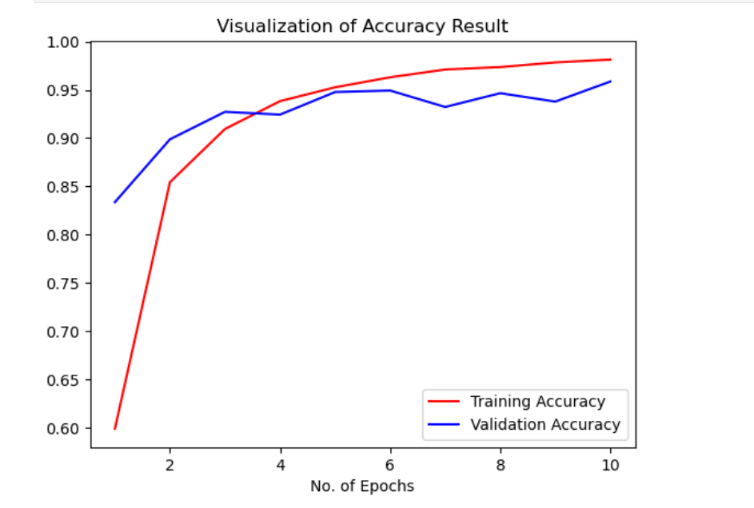
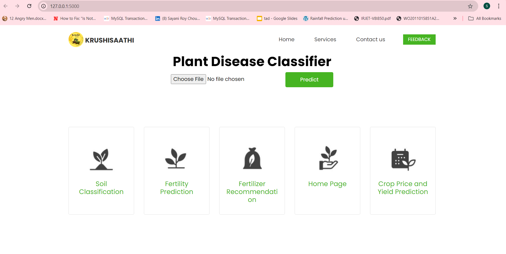
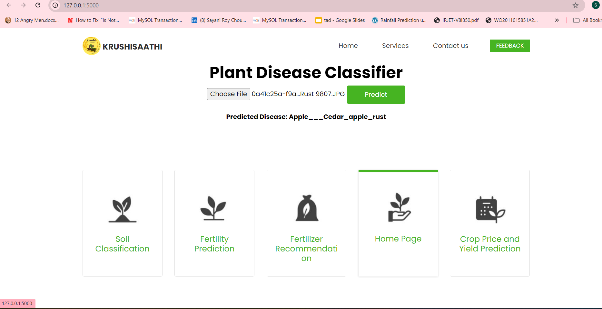

# Crop Disease Prediction Using Deep Learning

## Introduction
This project focuses on the early detection and prediction of plant diseases using deep learning techniques. Accurate and timely identification of crop diseases can help farmers take preventive measures and reduce crop loss, leading to increased productivity.

The model is trained using images of healthy and diseased crops, leveraging Convolutional Neural Networks (CNNs) to classify and predict different crop diseases. This solution aims to assist farmers in monitoring crops and managing diseases effectively, using a user-friendly web-based interface built with Flask and TensorFlow.

## Literature Survey
- **Deep Learning for Crop Disease Identification**: Recent advancements in deep learning have shown promising results in image classification tasks. CNNs, in particular, have been widely used in identifying crop diseases from leaf images.
- **CNN-Based Approaches**: CNNs have revolutionized image recognition and are the most effective architecture for image-based crop disease detection. Previous research, such as [Paddy Crop disease prediction- transfer learning technique], [Seasonal crops disease prediction and classification using deep convolution encoder network], demonstrated high accuracy when applied to agricultural datasets.
- **Use of Transfer Learning**: Transfer learning has been applied in many studies to enhance model performance when limited data is available. Pretrained models such as VGG16, ResNet50, and MobileNet are often fine-tuned for specific tasks like disease identification.
- **Impact on Agriculture**: According to [Research Report], the timely detection of diseases using automated systems reduces crop losses by 15-20%, highlighting the critical importance of technology in modern farming.

## Features
- **Model Architecture**: The project employs a CNN-based architecture to classify images of healthy and diseased crop leaves.
- **Dataset**: The model is trained on a publicly available crop disease dataset from kaggle that contains over 38 different classes of crop diseases.
- **Web Application**: A Flask-based web application allows users to upload leaf images and get predictions from the trained model in real time.
- **Interactive Visualization**: Streamlit is used for data visualization, allowing users to analyze model predictions and disease occurrence trends.
- **Deployment**: The model is deployed using TensorFlow Serving, ensuring scalability and responsiveness.

## Results
- **Accuracy**: The final model achieved an accuracy of 98.5% on the validation dataset and 95.8% on the test dataset, showing robust performance across a wide range of crop diseases.
- **Loss/Accuracy Curves**: The model's training and validation accuracy and loss curves are shown below, indicating convergence and good generalization.

  
  
  

## Usage
1. **Clone the repository**:
   ```bash
   git clone https://github.com/Sayani-123/crop-disease-prediction.git
   cd crop-disease-prediction
2. **Install Dependencies**:
    ```bash
    pip install -r requirements.txt
3. **Run the Flask app:**
    ```bash
    python disease.py
4.**Access the application:** Open your browser and go to http://127.0.0.1:5000/.
5.**Predict diseases:** Upload an image of a crop leaf to get disease prediction results.

## Technologies Used
-TensorFlow: For building and training the deep learning model.
-Scikit-learn: For data preprocessing and model evaluation.
-Pandas and NumPy: For data handling and manipulation.
-Flask: For building the web interface.
## Conclusion
This project demonstrates the potential of deep learning in agricultural technology by providing an automated, accurate, and scalable solution for crop disease detection. Future work could involve the expansion of the model to support more crop types and diseases, as well as the integration of IoT devices for real-time disease monitoring.
